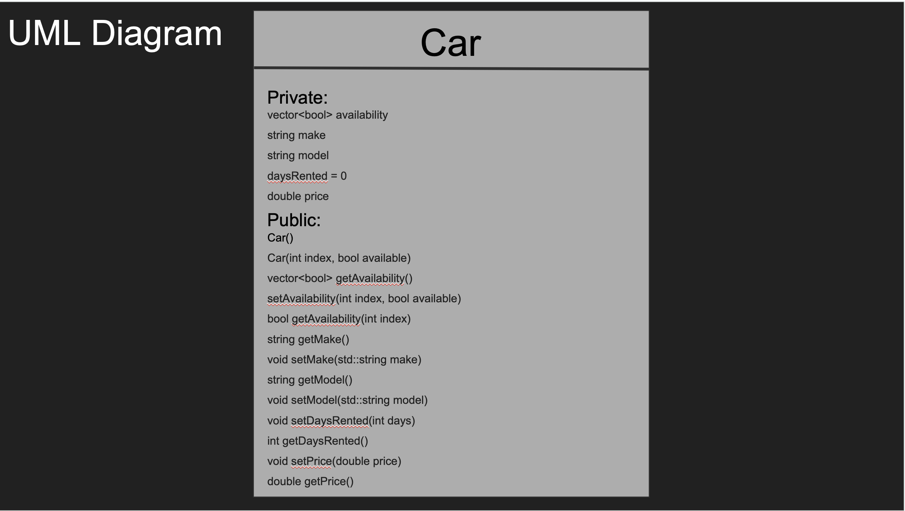
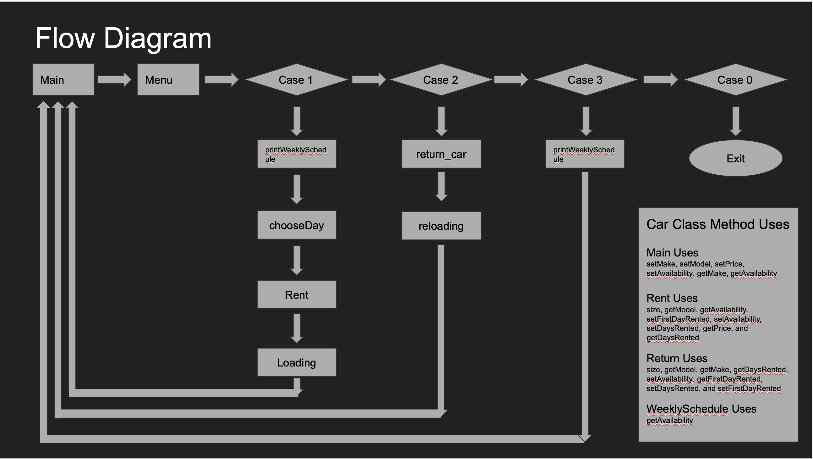

# Antiticipated Challenges
   - Megering code
   - Git
   - Communiacation
   - More codeing than antiticipated
# Group members and tasks
## Andrew: 
   - User Interface 
   - Menu 
## Luke : 
   - Schedule
   - class objects
## Josh: 
   - Car class 
   - Code breaker
## Kolby: 
   - Rent 
   - Return functions

# Slide Presentation
(Slides presentation)[https://docs.google.com/presentation/d/1I_sYdgSXUiIVj5skKLy5P8pCnnFjLZQfcXQVbZ0r9cI/edit?usp=sharing]

# Timeline
   - 2/22 Organization of tasks
   - 2/26 Proto code should be pushed
   - 3/5  Merging code together and debugging
   - 3/12 Final debug and talking about presentation
